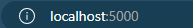
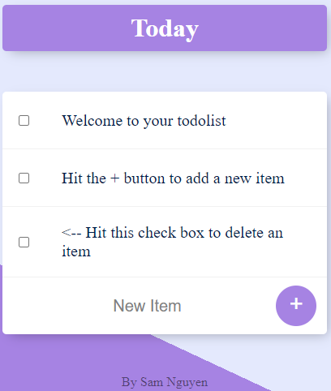
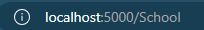
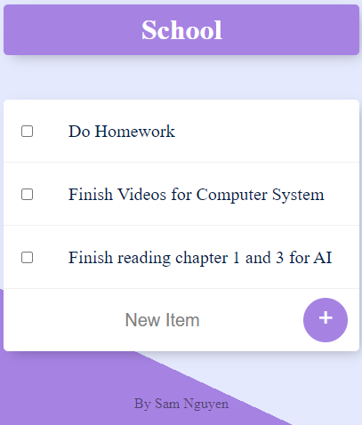

# Simple Todo List with JavaScript

Program is written in JavaScript

# Program features

Users can create custom list by changing the url
For example: localhost:5000 is the default list. A new list can be created by adding /nameOfList to the end of url

## default list

-  This is the default url

- 

  - This is the default list

## custom list

-  This is the custom url

- 

  - the custom list is created with the modified url
